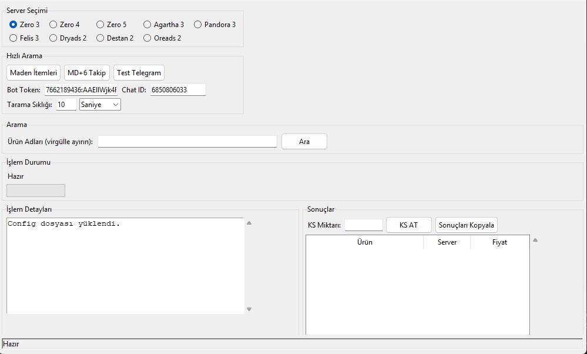

# 🛡️ KOPriceTracker

Knight Online item fiyatlarını otomatik olarak takip eden ve Telegram ile anlık bildirim gönderen fiyat izleme botu.

Herhangi bir item için en son fiyatları düzenli olarak tarar ve en iyi fırsatları kaçırmamanızı sağlar.


---

## 🚀 Özellikler

- Seçtiğiniz Knight Online serverlarında item fiyatlarını gerçek zamanlı takip eder.
- Seçtiğiniz ürünleri anlık olarak Telegram ile bildirim gönderir.
- MD+6 gibi özel itemler için sürekli tarama yapabilir.
- Konfigürasyon kaydı yapar (Bot Token ve Chat ID bilgileri kaydedilir).
- Selenium Stealth teknolojisi kullanır, tespit edilmeden çalışır.
- Kullanıcı dostu, modern bir arayüz (GUI) sunar.
- Tarama sıklığını istediğiniz gibi ayarlayabilirsiniz.

---

## 📸 Ekran Görüntüsü



> **KOPriceTracker** Arayüz görüntüsü.

---

## 🛠️ Kurulum


Gereken bağımlılıkları yükleyin:

```bash
pip install -r requirements.txt
```

> `tkinter` Python'un standart kütüphanesidir, ek kurulum gerekmez.

---

## ⚡ Kullanım

1. `python kopricetracker.py` komutuyla programı başlatın.
2. Açılan GUI arayüzünden:
   - İtem adlarını girin (virgül ile ayırın).
   - Server seçimi yapın.
   - Tarama sıklığını saniye veya dakika olarak belirleyin.
   - Telegram Bot Token ve Chat ID girin.
3. **Ara** butonuna tıklayın.
4. Sonuçlar listelenecek ve Telegram’a anlık bildirim gidecektir.
5. **MD+6 Takip** butonu ile özel bir item için sürekli tarama yapabilirsiniz.

---

## 📦 Gereksinimler

- Python 3.10 veya üzeri
- `selenium`
- `undetected-chromedriver`
- `selenium-stealth`
- `pyautogui`
- `requests`
- `pypiwin32`
- `python-telegram-bot`
- `tkinter` (Python built-in)

---

## 📜 Notlar

- Tarama işlemi Google Chrome üzerinde gerçekleştirilir.
- Chrome ve ChromeDriver sürümlerinizin uyumlu olduğundan emin olun.
- Web tarayıcı tespiti yapılmaması için **stealth mode** kullanılır.
- Telegram Bot oluşturmak için [@BotFather](https://t.me/botfather) kullanabilirsiniz.
- Telegram’da Botu bir sohbete ekleyip ID’sini almanız gereklidir.

---

## ⚠️ Önemli

**SİTE ARAYÜZÜNDE YAPILACAK DEĞİŞİKLİKLER BOTUN ÇALIŞMASINI BOZABİLİR VEYA ETKİLEYEBİLİR.**

---
